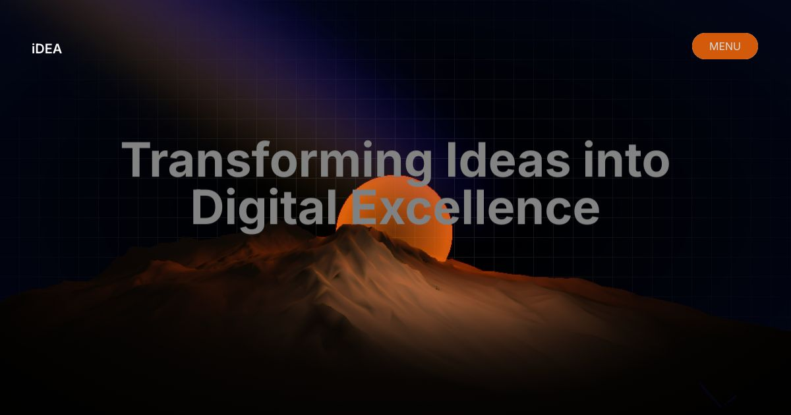
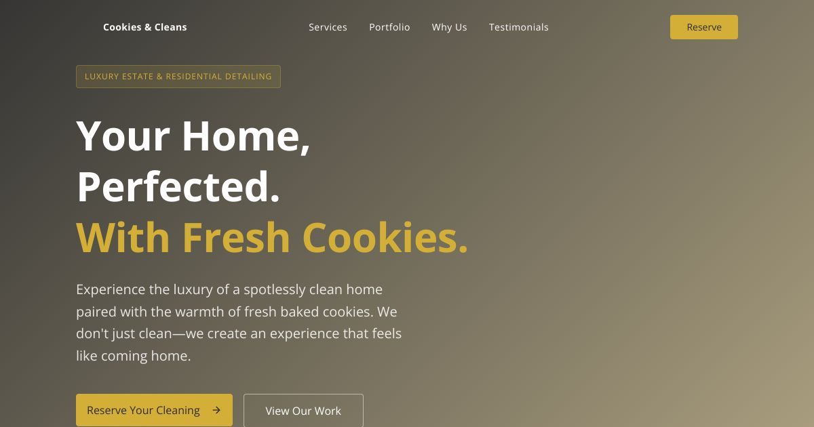
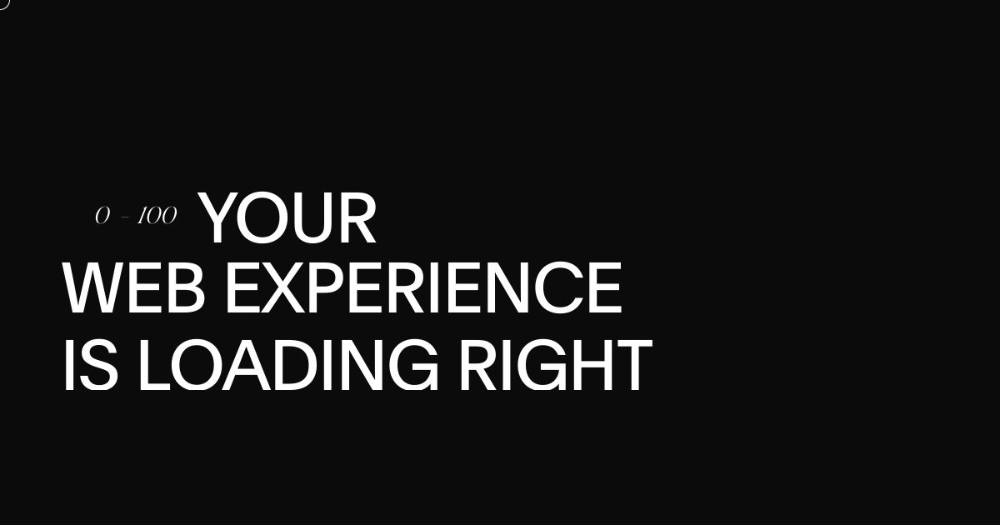
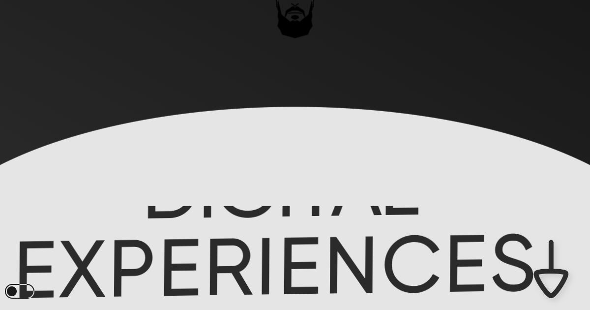

<h1 align="center">Hi there 👋, I'm Abe Toluwani</h1>
<h3 align="center">Software Engineer | Technical Writer | Hackathon Dev</h3>

  
  

## 👨‍💻 About Me

I'm a passionate software engineer with expertise in full-stack development, mobile applications, and DevOps. I love building scalable solutions and sharing knowledge through technical writing.

- 🔭 Currently working on innovative software projects
- 📝 Writing technical articles on [Medium](https://medium.com/@abetoluwani)
- 🎮 Gaming enthusiast in my free time
- 📫 Reach me at **cybertolu@protonmail.com**
- ⚡ Fun fact: I host **The Malware Podcast** on YouTube

## 🌐 Connect with Me

  

## 🚀 Projects

### 🌐 Web Projects
<table width="100%">
  <tr>
    <td width="25%" align="center" style="vertical-align: top; border: none;">
      
       
      <strong>Ideas</strong>
       
      Web platform project
    </td>
    <td width="25%" align="center" style="vertical-align: top; border: none;">
      
       
      <strong>Cookies & Clean</strong>
       
      Luxury Home Detailing
    </td>
    <td width="25%" align="center" style="vertical-align: top; border: none;">
      
       
      <strong>Vantage</strong>
       
      Portfolio Website
    </td>
    <td width="25%" align="center" style="vertical-align: top; border: none;">
      
       
      <strong>Craft and Co</strong>
       
      Studio Website
    </td>
  </tr>
</table>

### 💻 Desktop
<table width="100%">
  <tr>
    <td width="25%" align="center" style="vertical-align: top; border: none;">
      
       
      <strong>XSpaceByte</strong>
       
      Desktop platform project
    </td>
    <td width="25%" style="border: none;"></td>
    <td width="25%" style="border: none;"></td>
    <td width="25%" style="border: none;"></td>
  </tr>
</table>

### 🤖 AI Tools
<table width="100%">
  <tr>
    <td width="25%" align="center" style="vertical-align: top; border: none;">
      
       
      <strong>HotelRunner</strong>
       
      AI tool for UK hotels
    </td>
    <td width="25%" align="center" style="vertical-align: top; border: none;">
      
       
      <strong>Dovec-Extensions</strong>
       
      AI for Real Estate
    </td>
    <td width="25%" style="border: none;"></td>
    <td width="25%" style="border: none;"></td>
  </tr>
</table>

### 📱 Mobile
<table width="100%">
  <tr>
    <td width="25%" align="center" style="vertical-align: top; border: none;">
      
       
      <strong>Starter Template</strong>
       
      Flutter Mobile Template
    </td>
    <td width="25%" align="center" style="vertical-align: top; border: none;">
      <video src="https://github.com/user-attachments/assets/f1e6a5e0-593d-4172-baed-3834e45f4475" width="100%" controls muted playsinline style="border-radius:12px; margin-bottom:10px;"></video>
       
      <strong>3D with Flutter</strong>
       
      Rendering Application
    </td>
    <td width="25%" style="border: none;"></td>
    <td width="25%" style="border: none;"></td>
  </tr>
</table>

## 🛠️ Tech Stack

### Languages

### Frontend

### Backend & Mobile

### Databases

### DevOps & Tools

 
